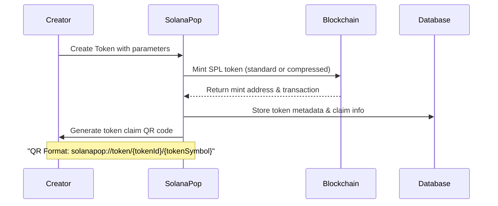
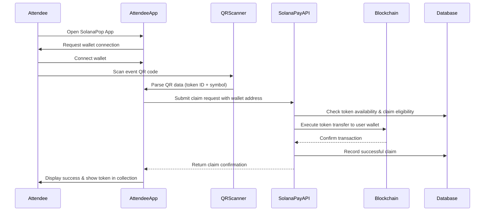

# SolanaPop

A token and event management platform built on Solana blockchain that leverages ZK Compression and Solana Pay for efficient token issuance and event ticketing.

> ⚠️ **WARNING**: This codebase has not been audited and is intended for demonstration purposes only. It should not be used in production environments. Use at your own risk.

**Hackathon Submission**: [1000x Hackathon](https://earn.superteam.fun/listing/1000x-hackathon/)

**Demo**: [Live App](http://ws0w08k8880c4c4g4cco88gk.34.67.137.207.sslip.io/)

**Demo Video**: [Loom Video](https://www.loom.com/share/4b78e0b2e32a44ec9ddd8c43a6922203?sid=3dab6696-8a1f-4684-a17d-2468d7677b25)

**Repository**: [GitHub](https://github.com/Blockchain-Oracle/solanaPop.git)

## Overview

SolanaPop is a comprehensive platform designed to streamline the creation, distribution, and management of tokens and events on the Solana blockchain. The application leverages Solana's high-speed, low-cost infrastructure and enhances it further with ZK Compression technology to make token management significantly more cost-effective.

## Features

- **Token Creation and Management**: Create fungible SPL tokens with customizable properties
- **ZK Compressed Tokens**: Reduce token costs by up to 5000x using Solana's ZK Compression
- **Event Creation**: Create public or private events with optional token requirements
- **Whitelist Management**: Manage access to tokens and events with whitelisting capabilities
- **QR Code Integration**: Generate and scan QR codes for token claims and event attendance
- **Solana Pay Integration**: Accept payments using the Solana Pay protocol
- **Mobile-Friendly Interface**: Responsive design for both desktop and mobile users

## Architecture

### Frontend

The frontend is built with React using a modern component architecture:

- **React** for UI components
- **Tailwind CSS** and **Shadcn/UI** for styling
- **Wouter** for routing
- **React Query** for data fetching and caching
- **React Hook Form** with **Zod** for form validation
- **Solana Wallet Adapter** for wallet connectivity

### Backend

The backend is built with Express.js and integrates with Solana's ecosystem:

- **Express.js** REST API
- **Drizzle ORM** with **PostgreSQL** for database management
- **@solana/web3.js** for Solana blockchain interactions
- **@metaplex-foundation** libraries for token metadata
- **@solana/pay** for payment processing
- **@lightprotocol/stateless.js** and **@lightprotocol/compressed-token** for ZK Compression

### Database Schema

The application uses PostgreSQL with the following main tables:

- **users**: User accounts with wallet addresses
- **tokens**: Token information including metadata and compression state
- **events**: Event information with optional token requirements
- **token_claims**: Tracks token claims by users
- **whitelists**: Manages access control for tokens and events

## ZK Compression

SolanaPop implements Solana's ZK Compression technology, allowing for:

- Up to 5000x cheaper token account creation
- Fully compatible with regular SPL tokens
- Atomic compression and decompression between SPL and compressed tokens
- Lower storage costs while maintaining Solana's security guarantees

## Solana Pay Implementation

SolanaPop extensively leverages Solana Pay for seamless token distribution and claiming. This section provides a detailed overview of how Solana Pay is implemented across different components of the system.

### Understanding Solana Pay in SolanaPop

Solana Pay is used in SolanaPop to enable:

1. **Tokenized Proof-of-Participation**: Generate and distribute tokenized proof of attending events
2. **QR Code-Based Claims**: Allow attendees to scan QR codes to claim tokens
3. **On-Chain Verification**: Securely verify all transactions on the Solana blockchain
4. **Wallet Integration**: Seamless interaction with user wallets for token claims

### Architecture Diagram

```
┌─────────────────┐     ┌─────────────────┐     ┌─────────────────┐
│                 │     │                 │     │                 │
│  Client/UI      │◄───▶│  Server/API     │◄───▶│  Solana Network │
│                 │     │                 │     │                 │
└────────┬────────┘     └────────┬────────┘     └────────┬────────┘
         │                       │                       │
         ▼                       ▼                       ▼
┌─────────────────┐     ┌─────────────────┐     ┌─────────────────┐
│ QR Scanner      │     │ Token Service   │     │ Blockchain      │
│ Wallet Connect  │     │ Transfer Service│     │ Transaction     │
│ UI Components   │     │ Storage Service │     │ Confirmation    │
└─────────────────┘     └─────────────────┘     └─────────────────┘
```

### Solana Pay Flow

#### 1. Token Creation and QR Generation



#### 2. Token Claim Process



### Database Schema for Solana Pay

The database structure supporting Solana Pay functionality includes:

```
┌───────────────┐       ┌───────────────┐       ┌───────────────┐
│    tokens     │       │  token_claims │       │     users     │
├───────────────┤       ├───────────────┤       ├───────────────┤
│ id            │──┐    │ id            │    ┌──│ id            │
│ name          │  │    │ tokenId       │◄───┘  │ username      │
│ symbol        │  └───▶│ userId        │       │ walletAddress │
│ mintAddress   │       │ walletAddress │       └───────────────┘
│ supply        │       │ claimedAt     │
│ claimed       │       │ transactionId │
│ isCompressed  │       │ reference     │
│ creatorAddress│       │ status        │
└───────────────┘       └───────────────┘
```

Key fields related to Solana Pay:
- **tokens.mintAddress**: The on-chain address of the token mint
- **tokens.isCompressed**: Whether the token uses ZK Compression
- **tokenClaims.walletAddress**: User's Solana wallet address for the claim
- **tokenClaims.transactionId**: Solana transaction signature
- **tokenClaims.reference**: Unique reference ID used for transaction tracking
- **tokenClaims.status**: Status of the claim (pending, confirmed, failed)

### Client-Side Implementation

The client-side implementation of Solana Pay involves multiple key components:

#### 1. QR Code Scanner

```tsx
// Simplified from client/src/components/qr-code-scanner.tsx
const QRCodeScanner = ({ onScan, onClose, isScanning }) => {
  // Initialize QR scanner
  useEffect(() => {
    if (isScanning && videoRef.current) {
      scannerRef.current = new QrScanner(
        videoRef.current,
        (result) => {
          console.log("QR Data detected:", result.data);
          onScan(result.data);  // Process detected QR code
        },
        {
          preferredCamera: 'environment',
          // Additional scanner options
        }
      );
      
      scannerRef.current.start();
    }
    
    // Cleanup when component unmounts
    return () => {
      if (scannerRef.current) {
        scannerRef.current.stop();
      }
    };
  }, [isScanning, onScan]);
  
  // Component rendering
};
```

#### 2. QR Code Parsing and Token Claiming

```tsx
// From client/src/components/attendee-view.tsx
const parseQrData = (qrData) => {
  // Parse format: solanapop://token/{tokenId}/{tokenSymbol}
  const qrRegex = /solanapop:\/\/token\/([^/]+)\/([^/]+)/;
  const match = qrData.match(qrRegex);
  
  if (!match || match.length < 3) return null;
  
  return {
    tokenId: match[1],
    tokenSymbol: match[2]
  };
};

const handleQrScan = async (qrData) => {
  try {
    // Parse QR data to extract token information
    const tokenData = parseQrData(qrData);
    if (!tokenData) {
      // Handle invalid QR code
      return;
    }
    
    // Process the token claim using React Query mutation
    claimTokenMutation.mutate(parseInt(tokenData.tokenId));
    
  } catch (error) {
    // Error handling
  }
};
```

#### 3. Wallet Integration

The application integrates with Solana wallets using the Solana Wallet Adapter:

```tsx
// Simplified wallet integration
const wallet = useWallet();  // Custom hook that wraps Solana Wallet Adapter

// Check wallet connection before operations
const handleScanClick = () => {
  if (!wallet.connected) {
    toast({
      title: 'Wallet Not Connected',
      description: 'Please connect your wallet to scan for tokens',
      variant: 'destructive'
    });
    return;
  }
  
  setIsScanning(true);
};
```

### Server-Side Implementation

The backend implementation handles token transfers, transaction verification, and claim recording:

#### 1. Token Claim API Endpoint

```typescript
// Simplified from server/routes.ts
app.post('/api/claims', async (req, res) => {
  try {
    const { tokenId, userId, walletAddress } = req.body;
    
    // 1. Validate the claim request
    const token = await getTokenById(tokenId);
    if (!token) return res.status(404).json({ error: 'Token not found' });
    
    // 2. Check if token can be claimed (supply, expiry, whitelist, etc.)
    if (token.claimed >= token.supply) {
      return res.status(409).json({ error: 'Token supply exhausted' });
    }
    
    // 3. Generate a unique reference for this claim
    const reference = crypto.randomBytes(32);
    const referenceStr = reference.toString('base64');
    
    // 4. Create pending claim record
    const claim = await createTokenClaim({
      tokenId,
      userId,
      walletAddress,
      reference: referenceStr,
      status: 'pending'
    });
    
    // 5. Execute the token transfer
    const transferService = new TransferService();
    const result = await transferService.transferToken(
      token,
      walletAddress,
      reference
    );
    
    // 6. Update claim status with transaction signature
    await updateClaimStatus(claim.id, 'confirmed', result.signature);
    
    // 7. Update token claimed count
    await incrementTokenClaimCount(tokenId);
    
    // 8. Return success with token information
    res.status(200).json({
      success: true,
      token,
      transactionId: result.signature
    });
    
  } catch (error) {
    // Error handling
    res.status(500).json({ error: error.message });
  }
});
```

#### 2. Transfer Service

The TransferService handles the actual token transfers on the Solana blockchain:

```typescript
// Simplified from server/services/transfer-service.ts
export class TransferService {
  private keysService: KeysService;
  private compressionService: CompressionService;
  
  constructor() {
    this.keysService = new KeysService();
    this.compressionService = new CompressionService();
  }
  
  async transferToken(token, recipientAddress, reference) {
    // Get service keypair for signing transactions
    const keypair = await this.keysService.getServiceKeypair();
    
    if (token.isCompressed) {
      // Handle compressed token transfer
      return await this.transferCompressedToken(
        token,
        keypair,
        recipientAddress,
        reference
      );
    } else {
      // Handle standard SPL token transfer
      return await this.transferStandardToken(
        token,
        keypair,
        recipientAddress,
        reference
      );
    }
  }
  
  private async transferStandardToken(token, keypair, recipientAddress, reference) {
    const connection = new Connection(process.env.SOLANA_RPC_URL);
    
    // Create transaction instruction for token transfer
    const transferInstruction = createTransferInstruction(
      new PublicKey(token.mintAddress),
      new PublicKey(recipientAddress),
      keypair.publicKey,
      1,  // amount (1 token)
      [],  // no additional signers
      TOKEN_PROGRAM_ID
    );
    
    // Add reference to transaction for tracking
    transferInstruction.keys.push({
      pubkey: new PublicKey(reference),
      isSigner: false,
      isWritable: false,
    });
    
    // Create, sign and send transaction
    const transaction = new Transaction().add(transferInstruction);
    const signature = await sendAndConfirmTransaction(
      connection,
      transaction,
      [keypair]
    );
    
    return { signature };
  }
  
  // Additional methods for compressed token transfers...
}
```

### Advanced Solana Pay Features

#### Reference-Based Transaction Tracking

SolanaPop implements the Solana Pay reference system to track and verify transactions:

1. **Unique Reference Generation**: Each token claim generates a unique reference identifier
2. **Reference Inclusion**: The reference is added to transaction instructions for on-chain tracking
3. **Transaction Verification**: The backend can verify that a specific claim transaction was executed by looking up the reference

```typescript
// Simplified reference handling
const reference = crypto.randomBytes(32);
const referenceBase64 = reference.toString('base64');

// Add reference to transaction
transferInstruction.keys.push({
  pubkey: new PublicKey(reference),
  isSigner: false,
  isWritable: false,
});

// Later, verify transaction completion
const signature = "transaction_signature_here";
const connection = new Connection(process.env.SOLANA_RPC_URL);
const transaction = await connection.getParsedTransaction(signature);

const isValid = transaction.transaction.message.accountKeys.some(
  key => key.pubkey.toBase58() === new PublicKey(reference).toBase58()
);
```

#### Integration with Compressed Tokens

SolanaPop uniquely combines Solana Pay with ZK Compression for more cost-effective token distributions:

```typescript
async transferCompressedToken(token, keypair, recipientAddress, reference) {
  // Using Light Protocol's compression SDK
  const compressedToken = await this.compressionService.getCompressedToken(
    token.stateTreeId,
    token.mintAddress
  );
  
  // Create compressed token transfer with reference
  const tx = await compressedToken.transfer({
    source: keypair.publicKey.toString(),
    destination: recipientAddress,
    amount: 1,
    reference: new PublicKey(reference),
  });
  
  // Sign and send the transaction
  const signedTx = await this.keysService.signTransaction(tx);
  const signature = await this.compressionService.sendTransaction(signedTx);
  
  return { signature };
}
```

### Testing and Development

For testing Solana Pay functionality without real transactions, SolanaPop includes:

1. **Mock Transfer Mode**: A testing mode that simulates transactions without blockchain interaction
2. **Development Endpoints**: Special API endpoints that return predictable responses for UI testing
3. **Transaction Simulation**: Capability to simulate transactions without submitting them

### Security Considerations

When implementing Solana Pay, several security measures are essential:

1. **Transaction Verification**: Always verify that transactions were executed as expected
2. **Reference Validation**: Ensure references match expected formats and sources
3. **Wallet Address Validation**: Validate wallet addresses before attempting transfers
4. **Supply Management**: Implement proper checks to prevent over-issuance of tokens
5. **Error Handling**: Comprehensive error handling for transaction failures

### Conclusion

SolanaPop's implementation of Solana Pay demonstrates how blockchain technology can be leveraged for token distribution and proof-of-participation use cases. By combining QR codes, wallet integration, and on-chain transactions, the platform provides a seamless user experience while maintaining the security and verifiability of blockchain technology.

## Services Layer Architecture

The core functionality of SolanaPop is implemented through a modular service-oriented architecture, with each service handling specific responsibilities:

### CompressionService
- Manages ZK Compression token operations
- Interfaces with Light Protocol's stateless.js and compressed-token libraries
- Provides critical methods:
  - `mintCompressedTokens()`: Creates new compressed tokens with minimal storage cost
  - `getCompressedTokenBalance()`: Retrieves user balances for compressed tokens
  - `transferCompressedTokens()`: Executes transfers between wallets with ZK proofs

### KeysService
- Central security management for blockchain interactions
- Handles keypair generation, storage, and access
- Manages service-specific keypairs:
  - Standard service keypair for general operations
  - Compression-specific keypair for ZK operations
  - Treasury keypair for financial operations
- Implements automated funding mechanisms to ensure service accounts have sufficient SOL

### TransferService
- Handles token transfer operations
- Implements transferring both standard SPL tokens and compressed tokens
- Coordinates with KeysService for signing transactions
- Manages on-chain confirmations and error handling

### TokenService
- High-level token management operations
- Interfaces with database for token record management
- Coordinates with MetadataService and CompressionService
- Handles token claim operations and supply management

### MetadataService
- Manages token and collection metadata
- Handles IPFS uploads for token images and metadata
- Creates and updates on-chain token metadata
- Implements Metaplex standards for token metadata

## System Interaction Flow

```
┌─────────────┐     ┌───────────────┐     ┌────────────────┐     ┌──────────────┐
│ API Routes  │────▶│ Service Layer │────▶│ Solana Network │────▶│ Database     │
└─────────────┘     └───────────────┘     └────────────────┘     └──────────────┘
                           │                      ▲
                           ▼                      │
                    ┌─────────────┐       ┌──────────────┐
                    │ ZK Proof    │       │ IPFS Storage │
                    │ Generation  │       │              │
                    └─────────────┘       └──────────────┘
```

1. **Client Requests**: Flow through Express routes to appropriate services
2. **Service Coordination**: Services interact with each other as needed:
   - TokenService uses CompressionService for compressed tokens
   - All services leverage KeysService for transaction signing
   - MetadataService works with TokenService for metadata management

3. **Blockchain Interaction**:
   - Standard operations use @solana/web3.js
   - Compressed token operations use Light Protocol libraries
   - ZK proofs are generated and validated when using compressed tokens

4. **Data Persistence**:
   - Token/Event metadata stored in PostgreSQL via Drizzle ORM
   - Token images and metadata stored on IPFS
   - State roots stored on-chain for ZK Compression

## ZK Compression Implementation

The compression flow works as follows:

1. User requests token creation with compression enabled
2. System fetches state tree information from ZK Compression RPC
3. Token is created with compressed state, reducing costs by up to 5000x
4. When transferring compressed tokens:
   - System fetches account state
   - Requests validity proofs from RPC
   - Bundles proof with transfer transaction
   - Submits transaction with additional compute budget

## Security Considerations

This project was developed as a hackathon submission and demonstrates concepts and technologies that can be used with Solana and ZK Compression. However, there are important security considerations to be aware of:

- **No Formal Audit**: The codebase has not undergone a formal security audit by blockchain security professionals.
- **Experimental Technology**: ZK Compression is a relatively new technology on Solana, and its implementation continues to evolve.
- **Key Management**: The service uses keypairs stored in environment variables which would need more robust security measures for production use.
- **Smart Contract Risks**: Interactions with smart contracts always carry inherent risks.
- **Limited Testing**: While the code has been tested in a development environment, it hasn't been rigorously tested for all edge cases or under high-load conditions.

For production applications, we strongly recommend:
- Conducting comprehensive security audits
- Implementing proper key management solutions
- Adding extensive error handling and recovery mechanisms
- Setting up monitoring and alerting systems
- Thoroughly testing all blockchain interactions under various conditions

## Getting Started

### Prerequisites

- Node.js (v16+)
- pnpm (preferred) or npm
- PostgreSQL database
- Solana wallet (for development testing)

### Installation

1. Clone the repository:
   ```bash
   git clone https://github.com/Blockchain-Oracle/solanaPop.git
   cd solanaPop
   ```

2. Install dependencies:
   ```bash
   pnpm install
   ```

3. Configure environment variables:
   ```
   cp .env.example .env
   # Edit .env with your database and Solana RPC details
   ```

4. Run database migrations:
   ```bash
   pnpm db:push
   ```

5. Start development server:
   ```bash
   pnpm dev
   ```

### Deployment

For production deployment:

1. Build the application:
   ```bash
   pnpm build
   ```

2. Start the production server:
   ```bash
   pnpm start
   ```

## Hackathon Context

This project was developed for the "1000x Hackathon" by ZK Compression, which focused on implementing Solana's ZK Compression technology. The hackathon challenged developers to create applications that leverage this technology to drastically reduce on-chain storage costs.

The competition emphasized applications that could best demonstrate the scaling capabilities of ZK Compression while maintaining user-friendly experiences. The SolanaPop project exemplifies this by combining compressed tokens with event management workflows, showcasing a practical use case for the technology.

## License

MIT 